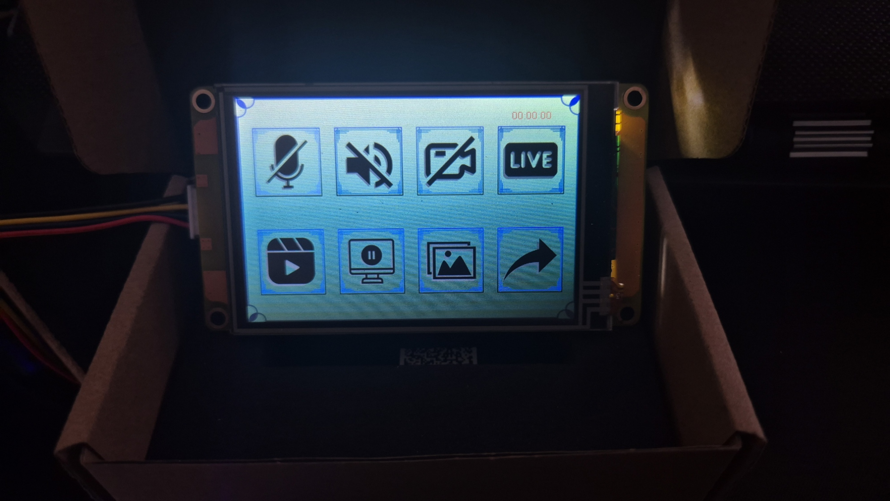

# 🚀 NexDeck - Hibrit Kontrol Paneli

# ŞUANDA PROTOTİP HALİNDEDİR...

NexDeck, içerik üreticileri ve profesyoneller için geliştirilmiş, yüksek maliyetli kontrol panellerine (Stream Deck vb.) yerli ve ekonomik bir alternatiftir.

### ✨ Öne Çıkan Özellikler
* **Hibrit Kontrol:** Nextion dokunmatik ekran + Fiziksel butonlar + Potansiyometre (Ses ayarı).
* **Maliyet Avantajı:** Piyasadaki muadillerinden %80 daha uygun maliyet.
* **Tam Özelleştirme:** AutoHotkey entegrasyonu ile sınırsız makro desteği.
* **Mekatronik Tasarım:** 3D yazıcı ile üretilen modüler gövde.

### 🛠️ Donanım Bileşenleri
* Arduino Micro (ATmega32U4)
* Nextion HMI Dokunmatik Ekran
* 10K Potansiyometre & Mekanik Butonlar

### 💻 Kurulum
1. `Firmware` klasöründeki kodu Arduino'ya yükleyin.
2. `Nextion` klasöründeki arayüzü ekrana flaşlayın.
3. `Software` klasöründeki AHK scriptini çalıştırın.
