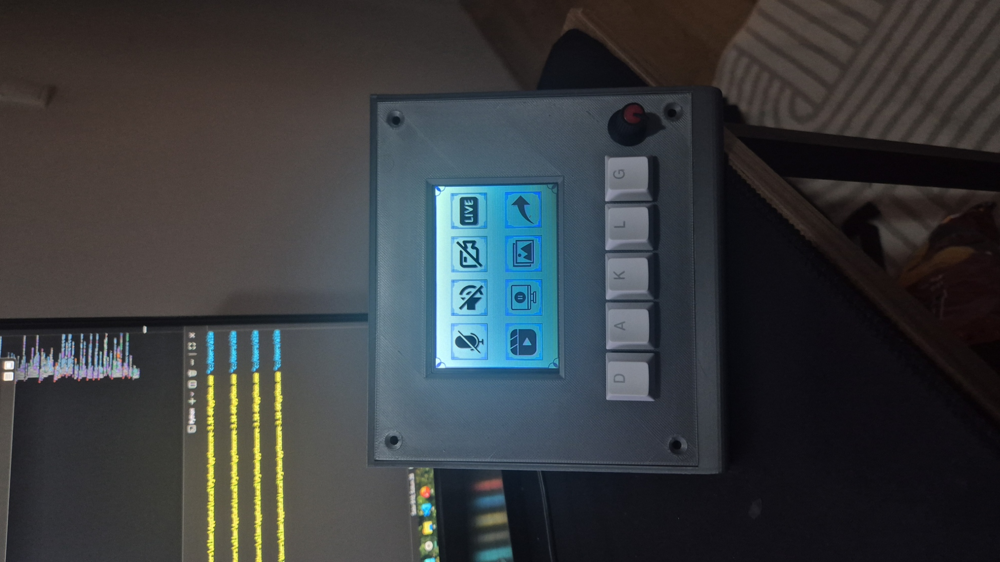
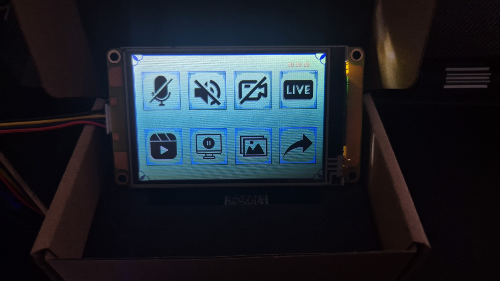

# 🚀 NexDeck - Hibrit Kontrol Paneli

## ŞU ANDA PROTOTİP HALİNDEDİR...



NexDeck, içerik üreticileri ve profesyoneller için geliştirilmiş, yüksek maliyetli kontrol panellerine (Stream Deck vb.) yerli ve ekonomik bir alternatiftir.

> Not: Projenin eski prototip görünümü `main.jpg` dosyasında korunmuştur.  
> Güncel cihaz görünümü ise `front.jpg` dosyasında yer almaktadır.

---

## 🆕 Güncelleme Notu - Yeni Arayüz ve Yazılım Geliştirmeleri

NexDeck projesi ilk prototip aşamasından sonra yalnızca donanım odaklı bir yapı olmaktan çıkarılarak daha gelişmiş bir masaüstü kontrol uygulamasına dönüştürülmüştür.  
Bu süreçte hem masaüstü yazılımı hem de mobil/web kontrol tarafı ciddi şekilde geliştirilmiştir.

### Yeni Eklenen ve Geliştirilen Özellikler

- Modern masaüstü kontrol uygulaması geliştirildi.
- Türkçe / İngilizce dil desteği düzenlendi.
- Fiziksel tuşlara görev atama sistemi geliştirildi.
- Dokunmatik ekran önizleme ve atama sistemi geliştirildi.
- Tekerlek / encoder kontrolü geliştirildi.
- Windows sistem sesi kontrolü geliştirildi.
- Uygulama bazlı ses karıştırıcısı entegrasyonu eklendi.
- Mobil Web Kontrolü özelliği eklendi.
- QR / PIN tabanlı bağlantı sistemi eklendi.
- Telefon üzerinden tuş atama ve temel kontrol desteği geliştirildi.
- Web arayüzü daha modern ve mobil uyumlu hale getirildi.
- Cihaz bağlı olmasa bile Web Kontrolü üzerinden atama ve test yapılabilecek yapı hazırlandı.
- Inno Setup ile kurulum paketi desteği eklendi.
- Lisans metni kurulum sürecine dahil edildi.
- Proje sahipliği ve marka bilgileri **Ali Mert Taşcı / NexHub** olarak düzenlendi.

---

## 🖼️ Görseller

### Yeni Cihaz Görünümü


### Eski Prototip Görünümü


---

## ✨ Öne Çıkan Özellikler

- **Hibrit Kontrol:** Nextion dokunmatik ekran + Fiziksel butonlar + Potansiyometre / Encoder (Ses ayarı)
- **Maliyet Avantajı:** Piyasadaki muadillerinden %80 daha uygun maliyet
- **Tam Özelleştirme:** AutoHotkey ve masaüstü yazılım desteği ile gelişmiş atama sistemi
- **Mekatronik Tasarım:** 3D yazıcı ile üretilen modüler gövde
- **Web Kontrolü:** Telefon üzerinden bağlantı ve kontrol imkanı
- **Geliştirilebilir Altyapı:** Açık yapısı sayesinde yeni özellik eklemeye uygun mimari

---

## 🛠️ Donanım Bileşenleri

- Arduino Micro (ATmega32U4)
- Nextion HMI Dokunmatik Ekran
- Encoder & Mekanik Butonlar

---

## 💻 Kurulum

### Donanım / İlk Prototip Kurulumu

1. `STDECK` klasöründeki kodu Arduino'ya yükleyin.
2. `Nextion` klasöründeki arayüzü ekrana flaşlayın (`dsplay.HMI`).
3. `Nextion` klasöründeki AHK scriptini çalıştırın.

### Masaüstü Yazılımı

Güncel NexDeck masaüstü uygulaması kaynak koddan veya hazır kurulum dosyasıyla kullanılabilir.

#### Kaynak Koddan Çalıştırma

```powershell
py -m venv .venv
.\.venv\Scripts\Activate.ps1
pip install -r requirements.txt
py src\nexstudio_ui.py
```

#### Kurulum Dosyası ile Kullanım

Son kullanıcılar için önerilen yöntem, GitHub **Releases** bölümünden kurulum dosyasını indirip yüklemektir.

---

## 🌐 Web Kontrolü

NexDeck Web Kontrolü sayesinde kullanıcılar aynı ağ üzerindeki telefonlarından uygulamaya bağlanabilir.

### Web Kontrolü ile Yapılabilenler

- Tuş atama
- Dokunmatik ekran önizleme
- Tekerlek / encoder kontrolü
- Bazı ses kontrol işlemleri
- Mobil uyumlu uzaktan kullanım

> Web Kontrolü şu anda cihaz bağlı olmadan da kullanılabilir.  
> Bu sayede kullanıcılar yalnızca telefon üzerinden atama yapabilir ve kontrolleri test edebilir.

---

## 📝 Proje Hakkında (Project Description)

**NexDeck**, dijital içerik üreticileri, yayıncılar ve profesyonellerin iş akışını optimize etmek amacıyla geliştirilmiş yerli ve ekonomik bir kontrol arayüzüdür. Piyasada bulunan yüksek maliyetli ve kapalı devre sistemlerin aksine NexDeck; hem dokunmatik ekranın esnekliğini hem de fiziksel potansiyometre ve butonların dokunsal hassasiyetini tek bir mekatronik gövdede birleştirir.

İlk sürümler donanım prototipi üzerine yoğunlaşırken, yeni geliştirmelerle birlikte NexDeck artık masaüstü uygulaması, mobil web paneli, ses karıştırıcısı entegrasyonu ve kullanıcı dostu kurulum sistemi ile daha kapsamlı bir çözüme dönüşmüştür.

---

## 🎯 Neden NexDeck?

- **Maliyet Etkinliği:** Mevcut profesyonel çözümlere kıyasla %80 daha düşük maliyetle üretilebilir.
- **Hibrit Kontrol:** Nextion HMI ekran üzerinden dijital sayfa kontrolü ve fiziksel encoder ile hassas ses yönetimi.
- **Açık Kaynak & Özgürlük:** Geliştirilmeye açık ve topluluk odaklı yapı.
- **Modüler Yapı:** 3D yazıcı ile üretilebilen, geliştirilmeye açık ve kişiselleştirilebilir donanım tasarımı.
- **Yazılım Genişletilebilirliği:** Masaüstü uygulaması ve web kontrol paneli ile daha güçlü kullanım senaryoları.

---

## 🛠️ Teknik Detaylar

NexDeck; **Arduino Micro** (ATmega32U4) mimarisi üzerine kurulu olup, bilgisayar ile sürücüsüz (Plug & Play) haberleşen bir **HID (Human Interface Device)** aygıtıdır. Seri haberleşme protokolleri ve düşük gecikmeli yazılım yapısıyla profesyonel düzeyde tepki süresi sunar.

Yeni yazılım tarafında ise:

- PyQt tabanlı masaüstü arayüz
- QR / PIN destekli mobil web erişimi
- Windows ses kontrolü ve ses karıştırıcısı entegrasyonu
- Inno Setup ile kurulum paketi oluşturma desteği

bulunmaktadır.

---

## 📝 Sürüm Notları

### v1.1 - Donanım Entegrasyonu ve Akıllı Kısayol Güncellemesi (Arduino Kod Düzenlenmesi)

- **Fiziksel Butonlar Aktif Edildi:** 5 adet push buton donanıma tanıtıldı. Spotify/Medya kontrolleri (Önceki, Oynat/Durdur, Sonraki), sistem geneli mikrofon susturma (F13) ve tek tuşla anında masaüstüne dönme (Panik/Gizlilik - Win+D) işlevleri eklendi.
- **Rotary Encoder Entegrasyonu:** Windows sistem sesini hassas şekilde açma/kısma ve tekerleğe basarak anında sessize alma (Mute) özelliği koda gömüldü.
- **İşitsel Geri Bildirim:** Sistemin açılışına ve buton basımlarına pasif buzzer ile dinamik onay sesleri eklendi.
- **Çekirdek Optimizasyonu:** Nextion dokunmatik ekranın mevcut özellikleri (OBS sahne geçişleri, yayın ve kayıt kronometreleri) yeni fiziksel donanımlarla tam senkronize ve çakışmasız çalışacak şekilde aynı loop içinde birleştirildi.

### v2.0 - NexStudio Masaüstü Uygulaması ve Web Kontrolü Güncellemesi

- Modern masaüstü kullanıcı arayüzü geliştirildi.
- Türkçe / İngilizce arayüz desteği eklendi.
- Fiziksel tuşlar ve dokunmatik ekran için gelişmiş görev atama sistemi eklendi.
- Encoder / tekerlek kontrol altyapısı geliştirildi.
- Windows sistem sesi ve uygulama bazlı ses karıştırıcısı desteği eklendi.
- Telefon üzerinden erişilebilen Web Kontrolü geliştirildi.
- QR / PIN ile hızlı bağlantı sistemi eklendi.
- Cihaz olmadan temel web kontrol ve atama desteği sağlandı.
- Inno Setup tabanlı kurulum paketi hazırlandı.
- Lisans ve proje sahipliği bilgileri güncellendi.

---

## 📂 Proje Yapısı

```text
NexDeck/
│
├─ README.md
├─ LICENSE.txt
├─ requirements.txt
├─ .gitignore
│
├─ src/
│  └─ nexstudio_ui.py
│
├─ installer/
│  └─ NexDeck_Setup.iss
│
├─ assets/
│  ├─ app_icon.ico
│  ├─ front.jpg
│  └─ main.jpg
│
├─ tools/
│  └─ nircmd.exe
│
└─ hardware/
   ├─ STDECK/
   └─ Nextion/
```

---

## 📜 Lisans

Bu proje **NEXSTUDIO ÖZGÜR YAZILIM LİSANSI (NPL-v2)** ile lisanslanmıştır.

**Telif Hakkı (c) 2026 - Ali Mert Taşcı / NexHub**
